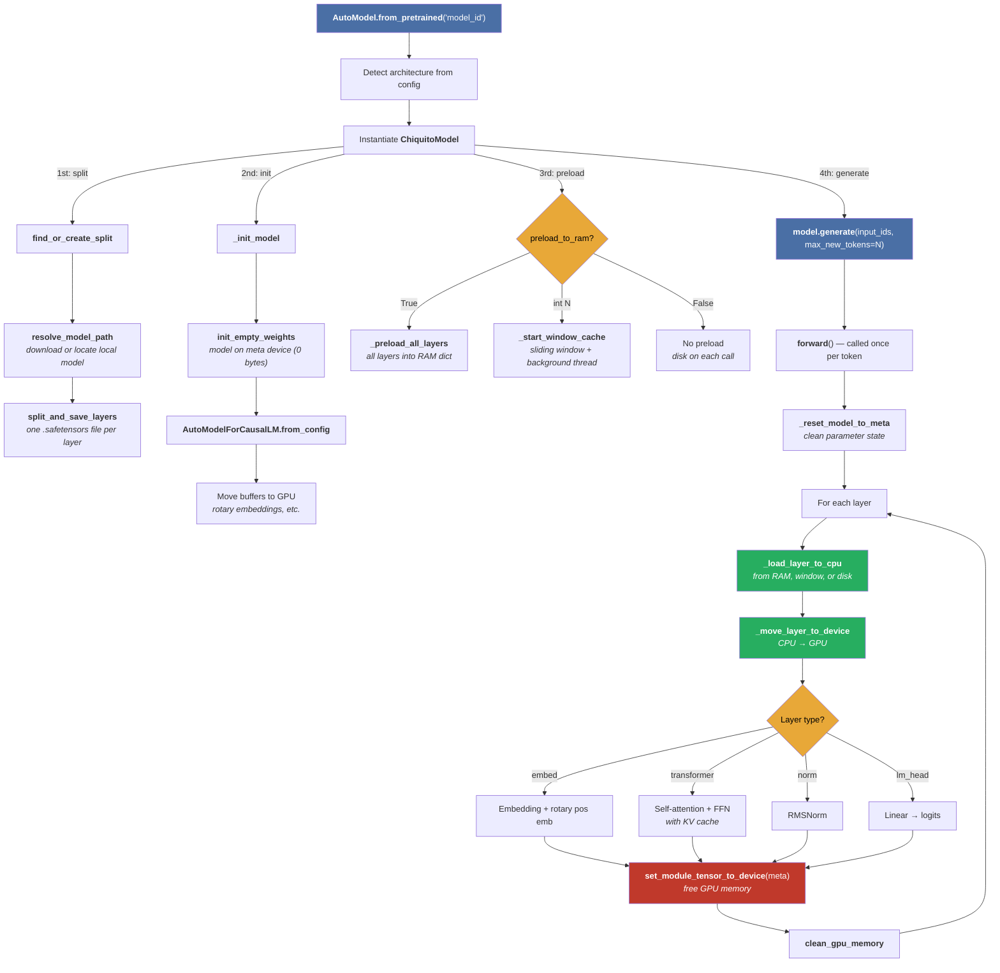

# Architecture Overview

## File structure

The program source code is in [src/chiquito](../src/chiquito/) and it consists in just a bunch of source files:

- **__init__.py**: Exports the main classes (`ChiquitoModel` and `AutoModel`).
- **auto_model.py**: Factory with architecture registry.
- **model.py**: `ChiquitoModel`, `_SlidingWindowCache`.
- **splitter.py**: Checkpoint splitting into per-layer files.
- **utils.py**: Memory cleanup, safetensors I/O, HuggingFace path resolution.

## Dependencies

Chiquito builds on top of the HuggingFace ecosystem:

- [PyTorch](https://pytorch.org/) — Tensor operations and GPU compute.
- [transformers](https://huggingface.co/docs/transformers) — Model configs, tokenizers, `GenerationMixin` for text generation, and `DynamicCache` for KV caching.
- [accelerate](https://huggingface.co/docs/accelerate) — `init_empty_weights()` to create models on [the meta device](https://huggingface.co/docs/accelerate/concept_guides/big_model_inference) without allocating memory, and `set_module_tensor_to_device()` to place individual parameters on a device.
- [safetensors](https://huggingface.co/docs/safetensors) — Fast, safe serialization format for tensors. Used for both reading HuggingFace checkpoints and writing per-layer splits.
- [huggingface-hub](https://huggingface.co/docs/huggingface_hub) — Downloads model files from the HuggingFace Hub.

## Data flow

## The meta device

The [meta device](https://huggingface.co/docs/accelerate/concept_guides/big_model_inference) is a PyTorch concept that allows creating tensors with a shape and dtype but no actual data. A model on the meta device describes the full architecture (layer types, parameter shapes, buffer values) without using any GPU or CPU memory for weights.

Chiquito uses this as follows:

1. **Init**: Create the full model on meta device. This gives us the correct module hierarchy and shapes.
2. **Per-layer load**: Use `set_module_tensor_to_device()` to replace a meta parameter with a real tensor loaded from a safetensors file.
3. **After execution**: Move the layer back to meta to free GPU memory.

This cycle repeats for every layer on every forward pass.
